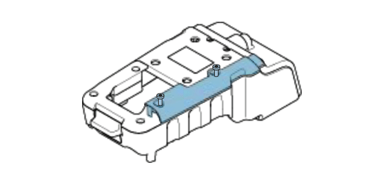
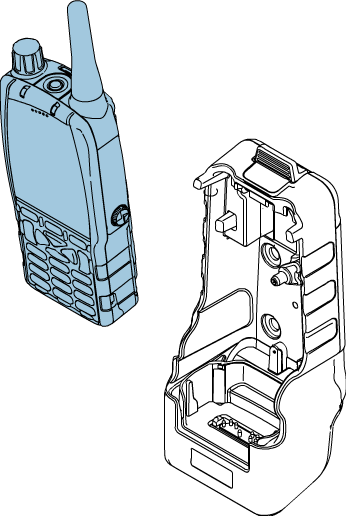

# Animation Examples

## Cubing animation

This animation shows how cubing (an algorithm which determines how products can fit into containers) works.&#x20;

**Software used:**\
Adobe Animate \
Adobe Illustrator

<figure><figcaption>
Example of how cubing works
</figcaption></figure>

## Communication hardware animations

These animations are created as examples of how Adobe Animate can be used to improve user guides. The original Creo drawings weren't available, so the images are taken from a user guide PDF, taken into Illustrator and then imported into Animate.

**Software Used**\
Adobe Acrobat\
Adobe Illustrator\
Adobe Animate

<figure><figcaption>
Removing a cover
</figcaption></figure>

<figure><figcaption>
Inserting a handset into a cradle and showing blinking lights when powered
</figcaption></figure>
